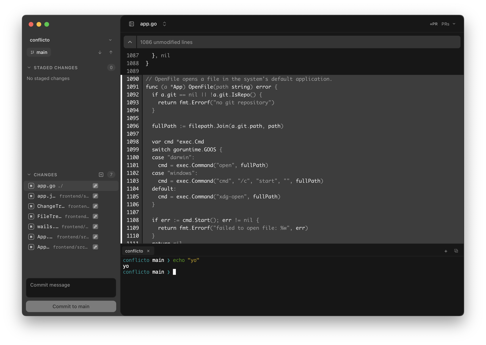

# conflicto 

<p align="center">

</p>
<p align="center">
  <span>Small on purpose. Sharp on every diff.</span>
</p>


> [!WARNING]
> 
> Alpha software, expects bugs 

## Prerequisites

- **Go** — [Go 1.26+](https://go.dev/dl/) (see `go.mod`). Needed to compile the Wails backend and run `make` targets.
- **GitHub CLI (`gh`)** — [Install gh](https://cli.github.com/), then authenticate:

  ```bash
  gh auth login
  ```

  PR listing, checkout, comments, and related GitHub features call `gh` at runtime. Diff viewing still works without it; GitHub integration does not.

Also required to build: [pnpm](https://pnpm.io/), [Node.js](https://nodejs.org/), and a C/C++ toolchain for [Wails](https://wails.io/) (platform deps vary — see the Wails docs).

## Build from source

```bash
git clone https://github.com/barelyhuman/conflicto.git
cd conflicto
make frontend-build
make build
```

That syncs the app icon and runs `wails build`. The binary lands under `build/bin/`.

Useful targets:

| Command | Description |
| --- | --- |
| `make dev` | Wails dev mode (live reload) |
| `make build` | Local debug binary |
| `make build-production` | Production binary (`-ldflags="-w -s" -trimpath`) |
| `make test` | Go + frontend tests |
| `make frontend-test` | Frontend unit tests (Vitest) |
| `make clean` | Remove build artifacts |

Frontend-only: `make frontend-dev` / `make frontend-build` (runs `pnpm` in `frontend/`). Vite alone has no Go backend — use `make dev` for a working UI.

## Keybindings

| Shortcut | Action |
| --- | --- |
| `Cmd/Ctrl+,` | Preferences |
| `Escape` | Close Preferences |
| `Cmd/Ctrl+R` | Reload |
| `Cmd+Ctrl+F` (macOS) / `Ctrl+F` | Full Screen |
| `Cmd/Ctrl+W` | Close window |
| `Cmd/Ctrl+Enter` | Commit (from commit message field) |
| `Ctrl+\`` | Toggle terminal dock |
| `Ctrl+Shift+\`` | New terminal tab (opens dock if needed) |
| `Cmd/Ctrl+\\` | Split terminal right (dock open) |

On macOS, the Edit menu also provides the usual text-editing shortcuts (`Cmd+A/C/V/X/Z`).
